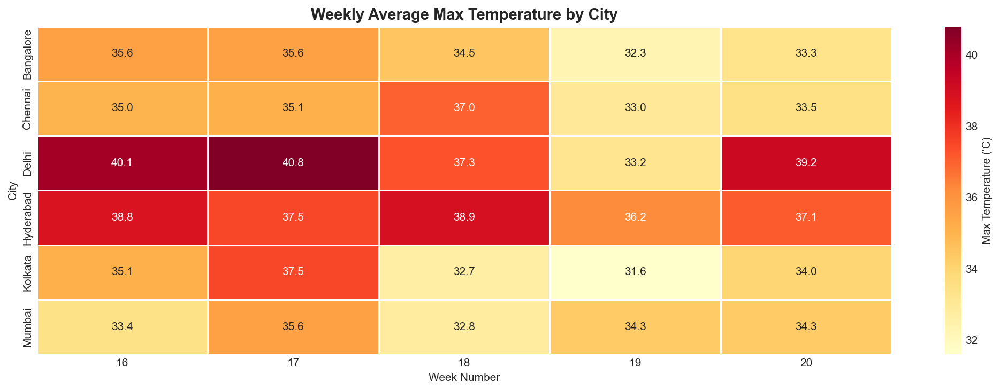

# 🌤️ Indian Cities Weather Dashboard

A data science project that fetches **real-time weather data** for 6 major Indian cities using a free API, cleans it with pandas, and visualizes it with matplotlib and seaborn.

---

## 📸 Output




---

## 📊 What It Shows

- **Average Max Temperature** by city (bar chart)
- **Total Rainfall** over last 30 days (horizontal bar chart)
- **Temperature Trend** over last 30 days (line chart)
- **Temperature vs Wind Speed** relationship (scatter plot)
- **Weekly Temperature Heatmap** by city (seaborn heatmap)

---

## 🛠️ Tech Stack

| Tool | Purpose |
|---|---|
| Python | Core language |
| requests | Fetch weather data from API |
| pandas | Clean and analyse data |
| matplotlib | Build the dashboard charts |
| seaborn | Build the heatmap |

---

## 🌐 API Used

**Open-Meteo** — completely free, no API key needed.

🔗 https://open-meteo.com/

Data fetched:
- Max temperature (°C)
- Min temperature (°C)
- Total precipitation (mm)
- Max wind speed (km/h)

---

## 🏙️ Cities Covered

| City | Latitude | Longitude |
|---|---|---|
| Mumbai | 19.08 | 72.88 |
| Delhi | 28.61 | 77.21 |
| Bangalore | 12.97 | 77.59 |
| Chennai | 13.08 | 80.27 |
| Kolkata | 22.57 | 88.36 |
| Hyderabad | 17.39 | 78.49 |

---

## 🚀 How to Run

**1. Clone the repo**
```bash
git clone https://github.com/anayduggal22/weather-dashboard
cd weather-dashboard
```

**2. Create virtual environment**
```bash
python -m venv venv
venv\Scripts\activate        # Windows
source venv/bin/activate     # Mac/Linux
```

**3. Install dependencies**
```bash
pip install -r requirements.txt
```

**4. Run the notebook**
```bash
jupyter notebook weather_dashboard.ipynb
```

Run all cells in order. Charts will be saved automatically as PNG files.

---

## 📁 Project Structure

```
weather-dashboard/
│
├── weather_dashboard.ipynb     # Main notebook
├── weather_data.csv            # Raw cleaned data (auto-generated)
├── city_summary.csv            # Summary per city (auto-generated)
├── weather_dashboard.png       # Dashboard output (auto-generated)
├── temperature_heatmap.png     # Heatmap output (auto-generated)
├── requirements.txt            # Dependencies
└── README.md                   # This file
```

---

## 🔍 How It Works

```
Open-Meteo API
      ↓
fetch_weather() — called for each city
      ↓
6 DataFrames (one per city, 30 days each)
      ↓
pd.concat() — combined into one DataFrame (180 rows)
      ↓
pandas — clean nulls, add calculated columns
      ↓
groupby city — city_summary table
      ↓
matplotlib — 4-chart dashboard
seaborn — weekly heatmap
      ↓
Saved as PNG files
```

---

## 📦 Requirements

```
requests
pandas
matplotlib
seaborn
jupyter
```

Install with:
```bash
pip install -r requirements.txt
```

---

## 🧠 What I Learned

- Calling REST APIs with the `requests` library
- Handling API responses and parsing JSON
- Cleaning and transforming data with pandas
- Building multi-chart dashboards with matplotlib
- Creating heatmaps and statistical charts with seaborn
- Using `groupby`, `pivot_table`, and `concat` in pandas

---

## 👤 Author

**Anay Duggal**
GitHub: [@anayduggal22](https://github.com/anayduggal22)

---

## 📄 License

MIT License — free to use and modify.
